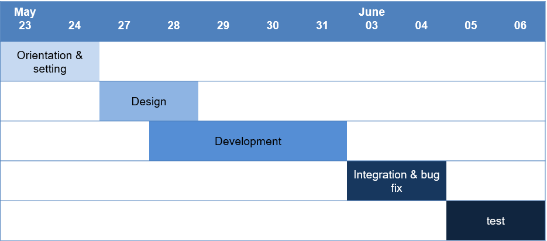

# GalaxyMemoryBoard

본 프로젝트는 삼성 청년 소프트웨어 아카데미 (SSAFY) 과정 중 해외 연수 과정에서 수행한 내용입니다.

삼성전자 베트남법인 모바일 센터 (SVMC)에서 진행하였고, 모바일 기기의 메모리 정보를 보여주는 웹 대시보드 페이지를 개발하였습니다.

참고로 이 프로젝트의 자세한 코드와 내용은 사내 보안상 공개가 불가하기 때문에 발표자료만 올린 상태입니다.

### 개발 인원

- 강민 : Team Manager & Front End
- 신동찬 : Front End
- 박민형 : Back End

### **개발환경**

- Front-End: Angular, Angular Material, Bootstrap4, canvasJS, highchart

- Back-End: Spring-boot, Jhipster

- DB: mongoDB

- IDE: STS, VS code, IntelliJ

### 배경 & 목적

- 배경
  - 삼성전자 모바일 기기의 메모리 문제가 이슈화 (메모리 문제로 어플 실행이 안되거나 실행도중 중단이 됨)
  - 모바일 기기 개발시 메모리 상태와 문제를 점검할 필요가 대두
  - 현지 베트남에서 진행중인 모바일 테스터 플랫폼 에서 메모리 점검 서비스를 개발 중
- 목적
  - 삼성전자 모바일 기기의 메모리 정보를 알려주는 대시보드 제작
  - 기기의 메모리 정보를 자동적으로 쉽고 간략하게 차트와 그래프를 이용하여 보여주기
  - 2개 이상의 정보를 동시에 보여주며 비교할 수 있게 보여주기

### 일정

### View

### 참고

<a href=".\ssafy베트남_강민.pptx">SSAFY베트남_발표자료</a>

